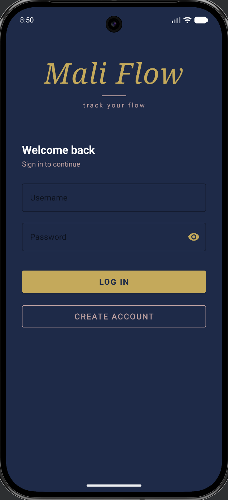
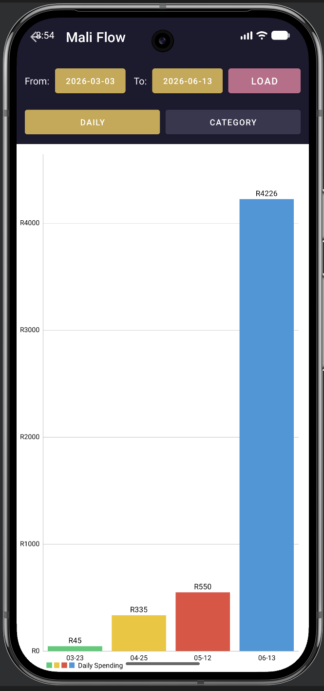
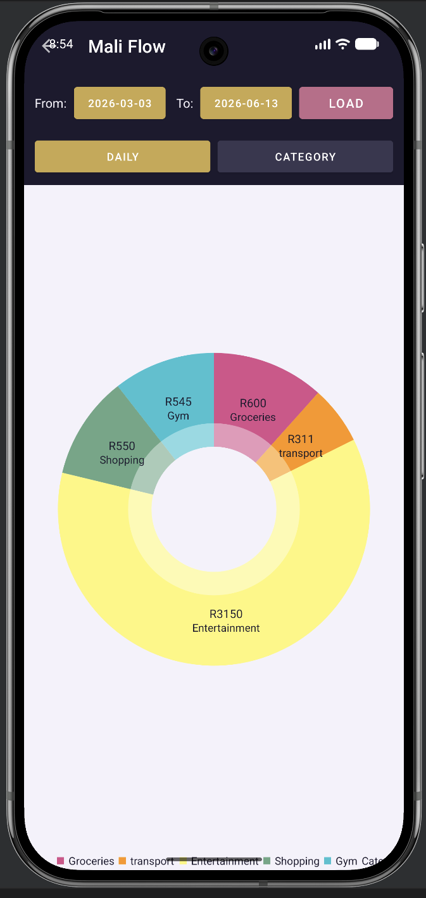
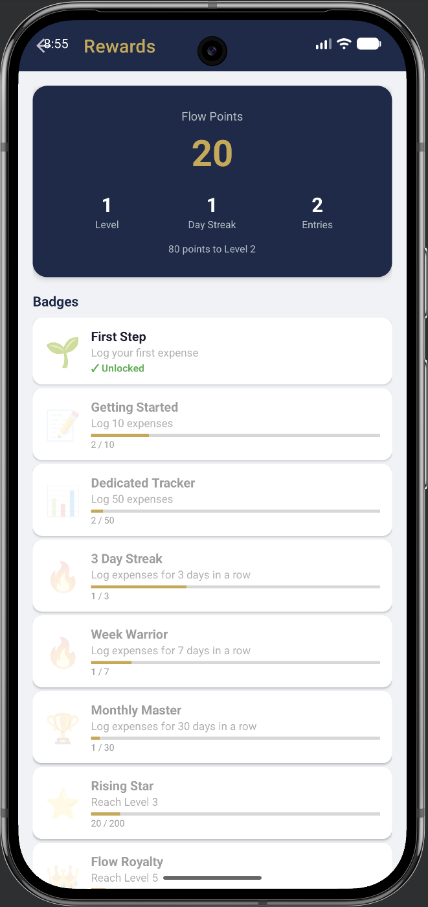

# Mali Flow

**Know where your mali goes.**

Mali Flow is a personal budget tracker app built for Android. "Mali" is the Zulu and Xhosa word for money, and the app was designed to make budgeting feel less stressful and more engaging through clear visuals and gamification.

This repository contains the final submission for the OPSC6311 Open-Source Coding module Portfolio of Evidence.

---

## Table of Contents

- [App Overview](#app-overview)
- [Features](#features)
- [Custom Features](#custom-features)
- [Screenshots](#screenshots)
- [Tech Stack](#tech-stack)
- [Design Considerations](#design-considerations)
- [Setup Instructions](#setup-instructions)
- [GitHub Actions / CI](#github-actions--ci)
- [Demo Video](#demo-video)
- [Project Structure](#project-structure)

---

## App Overview

Mali Flow helps users track their spending, set budget goals, and stay motivated through a points and badge system. The app stores all data locally on the device using Room (SQLite), so it works fully offline.

The app was developed across three stages:

1. **Part 1** - Research and Design
2. **Part 2** - Working prototype (login, categories, expenses, goals, totals)
3. **Part 3** - Final build (graphs, progress dashboard, gamification, and two original features)

---

## Features

### Minimum Requirements

- **User Registration and Login** - users register and log in with a username and password, validated locally and stored in RoomDB
- **Expense Categories** - users create, edit, and delete categories, each with its own emoji icon
- **Add Expense Entries** - log an expense with amount, description, date, start/end time, and category
- **Receipt Photos** - optionally attach a photo of a receipt to any expense entry, viewable from the expense list
- **Budget Goals** - set an overall monthly minimum and maximum spending goal, plus a monthly limit per category
- **Expense List by Period** - view all expenses filtered by week, month, or custom date range
- **Category Totals by Period** - view total spending per category for a selected period, with over-budget categories highlighted

### Final Submission Features

- **Spending Graphs** - a dedicated Graphs screen with:
  - A bar chart of daily spending over a selectable period, with horizontal lines marking the monthly minimum and maximum goals
  - A pie chart showing the percentage breakdown of spending by category
- **Progress Dashboard** - the home screen displays:
  - Colour-coded progress bars for each category with a budget limit (green = on track, amber = approaching limit, red = over budget)
  - Categories that are over budget clearly show how much they are over by
- **Gamification (Flow Points & Rewards)**
  - Users earn 10 Flow Points every time they log an expense
  - A daily streak counter tracks consecutive days of logging
  - A dedicated Rewards screen shows total points, current level, streak, and a badge grid
  - Badges unlock based on milestones (first expense, 10 expenses, 50 expenses, streak milestones, and level milestones)

---

## Custom Features

As required, Mali Flow includes two original features beyond the minimum specification.

### 1. Daily Budget Allowance

The home screen displays a "Today's Spending Allowance" card. This is calculated by taking the user's remaining monthly budget (maximum goal minus total spent so far this month) and dividing it by the number of days left in the month.

This means the user always knows exactly how much they can comfortably spend today, without doing any maths themselves. The card also shows how much budget remains overall and over how many days.

**Where to find it:** Home screen, directly below the welcome header.

### 2. Rollover Budget

Each category can have a "Rollover" toggle enabled from the Categories screen. When enabled, any portion of last month's budget limit that was *not* spent for that category is automatically added on top of the current month's limit when calculating progress.

For example, if a category has a R500 monthly limit and only R300 was spent last month, R200 rolls over and the effective limit for the current month becomes R700. This is calculated dynamically every time the dashboard loads, so it is always accurate without needing to store anything extra.

**Where to find it:** Categories screen (toggle switch on each category), reflected in the Category Progress section on the Home screen.

---
## Screenshots

| Login | Dashboard |
|---|---|
|  | .png) |

| Spending Graphs (Daily) | Spending Graphs (Category) |
|---|---|
|  |  |

| Dashboard (Full) | Rewards |
|---|---|
| .png) |  |


## Tech Stack

- **Language:** Kotlin
- **Database:** Room (SQLite)
- **UI:** ViewBinding, Material Components, CardView
- **Charts:** [MPAndroidChart](https://youtube.com/shorts/kt06D_R4vwo)
- **Architecture:** LiveData, Coroutines, lifecycleScope
- **Build:** Gradle (Kotlin DSL)
- **CI/CD:** GitHub Actions

---

## Design Considerations

The colour palette uses deep navy (`#1c1a2e`), warm gold (`#c9a84c`), and dusty rose (`#c06b8a`), chosen to feel calm, professional, and distinct from the bright, cluttered palettes common in other budgeting apps. Red (`#b85c5c`) is used consistently across the app to indicate overspending so the meaning is always clear at a glance.

The app icon is a gold medallion with an "MF" monogram, designed to evoke a sense of trust and value, similar to a minted coin.

All design decisions were informed by research into three existing budgeting apps (Wallet by BudgetBakers, Spendee, and Toshl Finance), documented in the Part 1 research and design documents included in this repository.

---

## Setup Instructions

1. Clone this repository
2. Open the project in Android Studio (tested on the Pixel 9 Pro emulator, API 36.1)
3. Let Gradle sync - all dependencies (including MPAndroidChart via JitPack) are declared in `build.gradle.kts`
4. Build and run on an emulator or physical device

No additional configuration or API keys are required - all data is stored locally.

---

## GitHub Actions / CI

This repository uses GitHub Actions to automatically build the project and run unit tests on every push. The workflow configuration can be found in `.github/workflows/`.

This project uses GitHub Actions for continuous integration. On every push to the main branch, the workflow automatically compiles the app and runs unit tests to ensure code quality and stability
---

## Demo Video

A full walkthrough of the app, including all required and custom features, is available here:

[Demo Video Link - YouTube [(https://youtube.com/shorts/D6ppRxkBnGg)]

---

## Project Structure

```
app/src/main/java/com/example/maliflow/
├── data/
│   ├── dao/          # Room DAOs (User, Category, ExpenseEntry, Goal, FlowPoints)
│   ├── database/      # AppDatabase, Application class
│   └── model/         # Entity classes
├── *Activity.kt        # Screens (Login, Register, Home, Categories, AddEntry,
│                        # ViewEntries, Goals, CategoryTotals, Graphs, Rewards)
├── *Adapter.kt          # RecyclerView adapters
└── GamificationHelper.kt # Flow Points and streak logic
```

---

## Author

Mahlatse
OPSC6311 Portfolio of Evidence.
